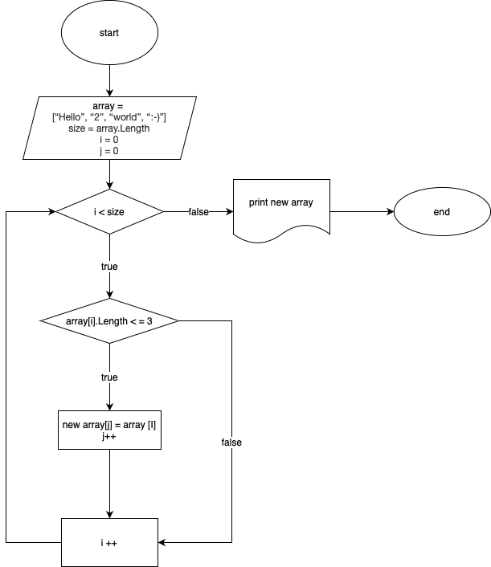

## Задача: Написать программу, которая из имеющегося массива строк формирует новый массив из строк, длина которых меньше, либо равна 3 символам. Первоначальный массив можно ввести с клавиатуры, либо задать на старте выполнения алгоритма. При решении не рекомендуется пользоваться коллекциями, лучше обойтись исключительно массивами.

Ниже представлена блок-схема решения поставленной задачи.

Для формирования нового массива необходимо пройти цикл проверки первоначального массива на размер каждого элемента. В случае, если элемент меньше и или длиной в три символа, то его записываем в новый массив и для нового массива увеличиваем инкремент, иначе возвращаемся к проверке следующего элемента первоначального массива. 

Для печати массива на экран создаем отдельный метод PrintArray.